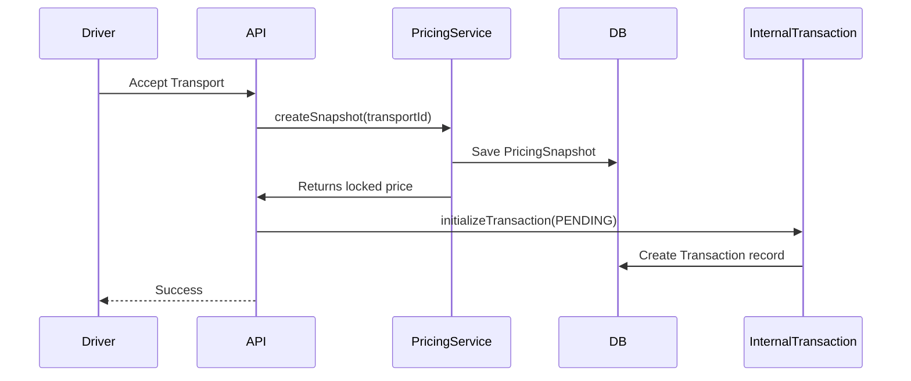
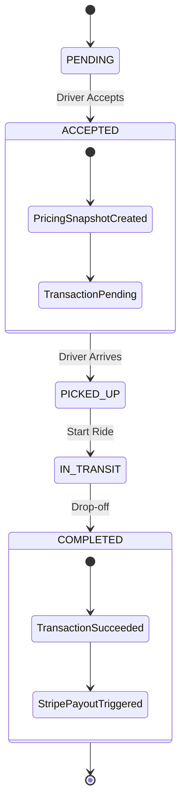

# Payment & Pricing Flow Documentation

## Overview
The payment system manages transport pricing, driver payouts, and shelter billing. It uses **Stripe Connect** for drivers (Express accounts) and **Stripe Billing** (Payment Intents/Setup Intents) for shelters.

## 1. Pricing Calculation
When a transport is requested, the system calculates an estimated price.

### Formula
`Total Cost = Base Fare + (Distance * Rate/Mile) + (Time * Rate/Min) + Complexity Fee + Platform Fee`

### Process
1.  **Shelter** creates a transport request.
2.  **PricingService** fetches:
    *   Latest `PricingRule` (Admin configured).
    *   `AnimalComplexityFee` based on animal type.
    *   Distance/Duration from **Google Maps API**.
3.  **PricingService** returns the estimate.

## 2. Transport Acceptance & Locking Price
When a driver accepts a transport, the price is locked to ensure it doesn't change even if admin rules are updated.

### Sequence

## 3. Driver Onboarding (Stripe Connect)
Drivers must connect a Stripe Express account to receive payouts.

### Sequence
1.  **Driver** requests onboarding link (`POST /driver-payment/onboarding-link`).
2.  **API** calls Stripe `accounts.create` (if new) and `accountLinks.create`.
3.  **Driver** is redirected to Stripe to complete KYC and add bank details.
4.  **Driver** returns to the app (onboarding status updated).

## 4. Shelter Billing Setup
Shelters add a payment method (Credit Card) to pay for transports.

### Sequence
1.  **Shelter** requests setup (`POST /shelter-payment/setup-intent`).
2.  **API** creates a Stripe Customer (if needed) and a `SetupIntent`.
3.  **Shelter** frontend uses `client_secret` to show Stripe Elements card input.
4.  **Stripe** saves the card as the default payment method.

## 5. Completing a Trip & Payouts
1.  **Driver** marks transport as `COMPLETED`.
2.  **API** updates status and finalizes the internal transaction.
3.  *(Future)* **Stripe Service** triggers a `Destination Charge`:
    *   Charges the Shelter's default payment method.
    *   Takes the **Platform Fee**.
    *   Transfers the rest to the **Driver's Express Account**.

### State Transitions

## 6. History & Auditing
*   **Admins**: View all transactions via `GET /admin-payment/transactions`.
*   **Drivers**: View their payouts via `GET /driver-payment/history` or Stripe Dashboard.
*   **Shelters**: View their payments via `GET /shelter-payment/history`.
